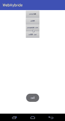

#web - android 混合开发
    1.集成简单:compile 'com.mainli:webhybrid:1.0.0'
        
    2.支持配置自定义协议,使用正则截取参数放入HashMap<String, String>
    
    3.js调用java两种方式,如:
        function btn3() {
              prompt("client://name=按钮3&alert=按钮3弹出&call1=java2js");
        }
        function btn4() {
              window.location.href = "http://www.baidu.com?client://name=按钮4&alert=按钮4弹出来的&call=java2js";
        }
 
####一、js调用java层两种方式:

    1.直接在URL后面加上自定义协议
    2.在js中使用Prompt提示框

####二、java层集成:

######1.集成步骤:
        //设置WebView属性，能够执行Javascript脚本
        WebSettings settings = webView.getSettings();
        settings.setJavaScriptEnabled(true);
        //实例化拦截器 并加入分发管理器
        Interceptor interceptor = new Interceptor(this, new DistributManage() {
            @Override
            public JSAction onIntercept(HashMap<String, String> param) {
                String name = param.get("name");
                JSAction jsAction = null;
                switch (name) {
                    case "按钮1":
                        jsAction = new JSPrint1();
                        break;
                    case "按钮2":
                        jsAction = new JSPrint2();
                        break;
                }
                return jsAction;
            }
        });//默认协议开头client://
        webView.setWebChromeClient(new HybridWebChromeClient(interceptor));
        webView.setWebViewClient(new HybridWebClient(interceptor));
######2.自定义待分发JsAction
    如:   
        public class JSPrint1 implements JSAction {
            @Override
            public void executeJS(Activity activity, WebView webView, HashMap<String, String> param) {//运行JS请求
                System.out.println("Js传来参数" + param);
                String call = param.get("cal");
                if (TextUtils.isEmpty(call)) call = "call";
                Toast.makeText(activity, call, Toast.LENGTH_SHORT).show();
                JSCall.executeJavaScript(webView, call, param.get("alert"));//执行回调JS代码如果需要
            }
        
            @Override
            public boolean needJSBeforeRun(HashMap<String, String> param) {//判断是否需要执行JS回调之前时候执行一个回调 如获取用户信息前需要登录的操作
                return false;
            }
        }
        
####二、自定义协议头:
    默认协议为: client://key1="参数1"&key2="参数2"&key3="参数3"&key4="参数4"......
    
    修改协议头在实例化InterceptorConfig时传入。
    
    例:
    Interceptor interceptor = new Interceptor(this, new DistributManage() {
            @Override
            public JSAction onIntercept(HashMap<String, String> param) {
                        return null;
            }
    },new InterceptorConfig("xxx://"));
######InterceptorConfig默认两个参数:   
        //自定义请求协议头部
        public String mAgreementHead = "client://";
        //截取参数正则表达式(建议不修改)
        public String mAgreementParamRegular = String.format("(?:%s|&)([^=^&]+)=([^&]*)", mAgreementHead);     

           
                
    
   
    
######suspension(一个RecyclerView头部悬停的Demo)与本项目无关
    